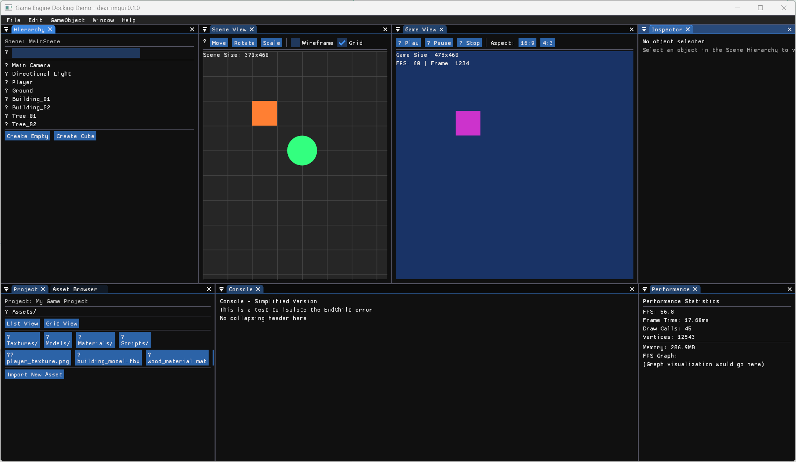
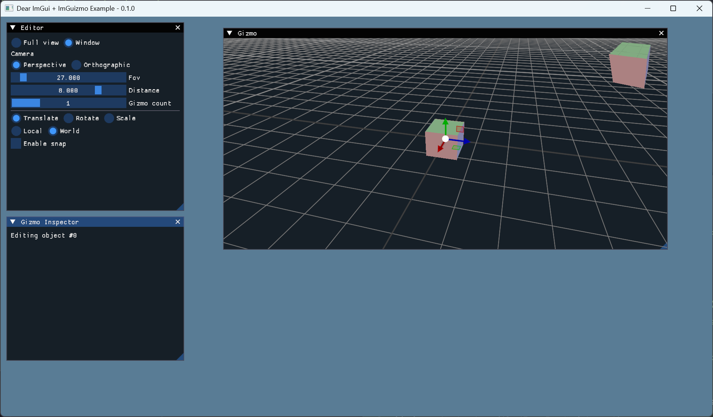
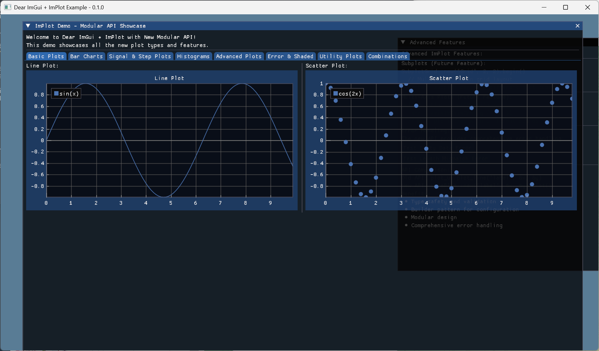
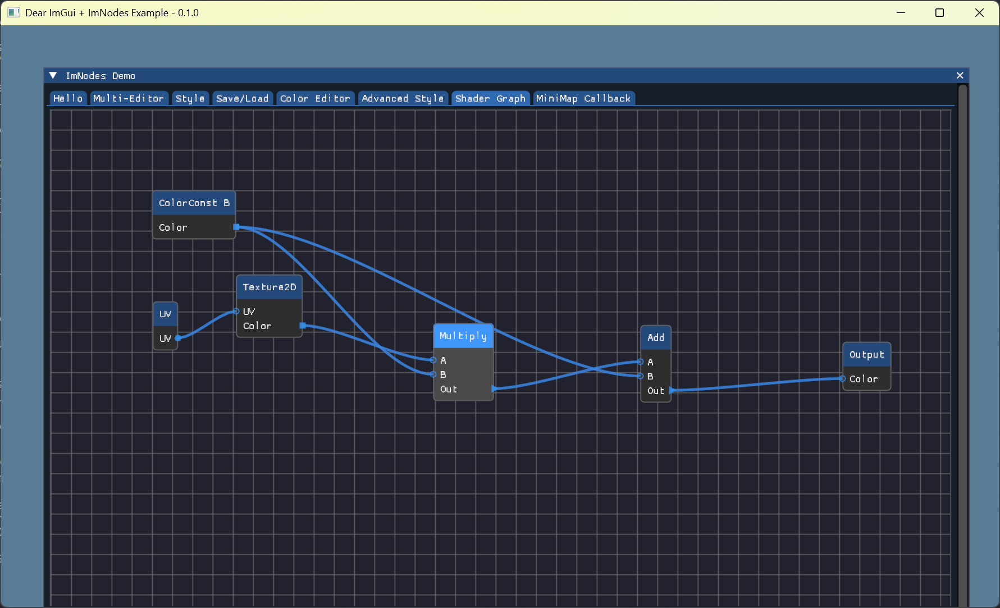

# Dear ImGui (Rust) Workspace

Rust bindings and ecosystem around Dear ImGui, with docking, WGPU/GL backends, and popular extensions (ImGuizmo, ImNodes, ImPlot).

<p align="center">
  
  
  <br/>
  
  
</p>

## What’s in this repo

- Core
  - `dear-imgui-sys` — low‑level FFI via cimgui (docking branch), bindgen against Dear ImGui v1.92.3
  - `dear-imgui` — safe, idiomatic Rust API (RAII + builder style similar to imgui-rs)
  - Backends: `dear-imgui-wgpu`, `dear-imgui-glow`, `dear-imgui-winit`
- Extensions
  - `dear-imguizmo` — 3D gizmo (cimguizmo C API) + a pure‑Rust GraphEditor
  - `dear-imnodes` — node editor (cimnodes C API)
  - `dear-implot` — plotting (cimplot C API)

All crates are maintained together in this workspace.

## Hello, ImGui (Hello World)

```rust
use dear_imgui::*;

let mut ctx = Context::create_or_panic();
let ui = ctx.frame();
ui.window("Hello")
  .size([300.0, 120.0], Condition::FirstUseEver)
  .build(|| {
      ui.text("Hello, world!");
      if ui.button("Click me") { println!("clicked"); }
  });
// Rendering is done by a backend (e.g. dear-imgui-wgpu or dear-imgui-glow)
```

## Examples

```bash
# Core & docking
cargo run -p dear-imgui-examples --bin game_engine_docking

# Extensions
cargo run -p dear-imgui-examples --bin imguizmo_basic   --features dear-imguizmo
cargo run -p dear-imgui-examples --bin imnodes_basic    --features dear-imnodes
cargo run -p dear-imgui-examples --bin implot_basic     --features dear-implot
```

Tip: The ImNodes example includes multiple tabs (Hello, Multi-Editor, Style, Advanced Style, Save/Load, Color Editor, Shader Graph, MiniMap Callback).

## Installation

```toml
[dependencies]
dear-imgui = "0.2"
# choose a backend + platform integration
dear-imgui-wgpu = "0.2"   # or dear-imgui-glow
dear-imgui-winit = "0.2"
```

## Version & FFI

- FFI layer is generated from the cimgui “docking” branch matching Dear ImGui v1.92.3.
- We avoid the C++ ABI by using the C API + bindgen. The safe layer mirrors imgui-rs style (RAII + builder).

## Crates (workspace)

```text
dear-imgui/            # Safe Rust bindings
dear-imgui-sys/        # cimgui FFI (docking; ImGui v1.92.3)
backends/
  dear-imgui-wgpu/     # WGPU renderer
  dear-imgui-glow/     # OpenGL renderer
  dear-imgui-winit/    # Winit platform
extensions/
  dear-imguizmo/       # ImGuizmo + pure‑Rust GraphEditor
  dear-imnodes/        # ImNodes (node editor)
  dear-implot/         # ImPlot (plotting)
```

## Acknowledgments

This project builds upon the excellent work of several other projects:

- **[Dear ImGui](https://github.com/ocornut/imgui)** by Omar Cornut - The original C++ immediate mode GUI library
- **[imgui-rs](https://github.com/imgui-rs/imgui-rs)** - Provided the API design patterns and inspiration for the Rust binding approach
- **[easy-imgui-rs](https://github.com/rodrigorc/easy-imgui-rs/)** by rodrigorc
- **[imgui-wgpu-rs](https://github.com/Yatekii/imgui-wgpu-rs/)** - Provided reference implementation for WGPU backend integration


## License

Dual-licensed under either of:
- Apache License, Version 2.0 (<http://www.apache.org/licenses/LICENSE-2.0>)
- MIT license (<http://opensource.org/licenses/MIT>)

