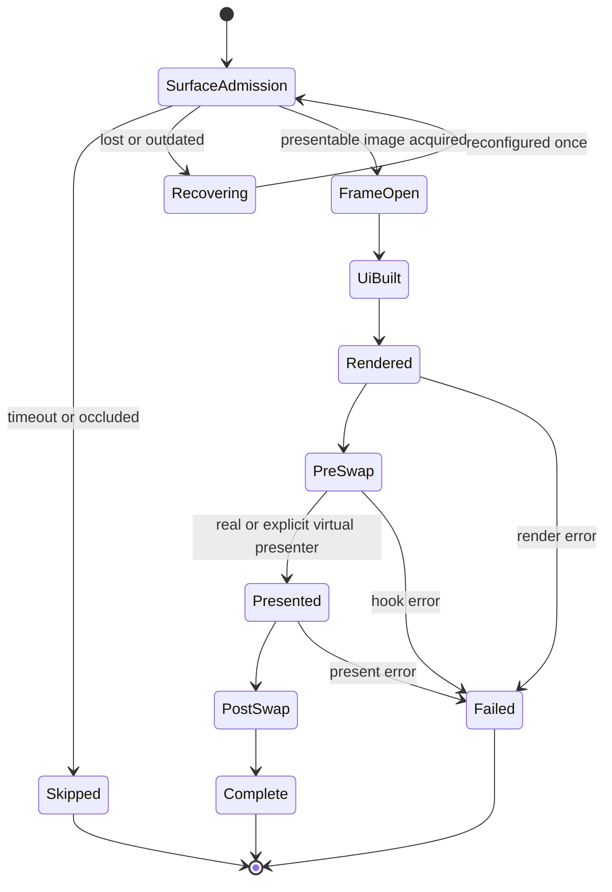
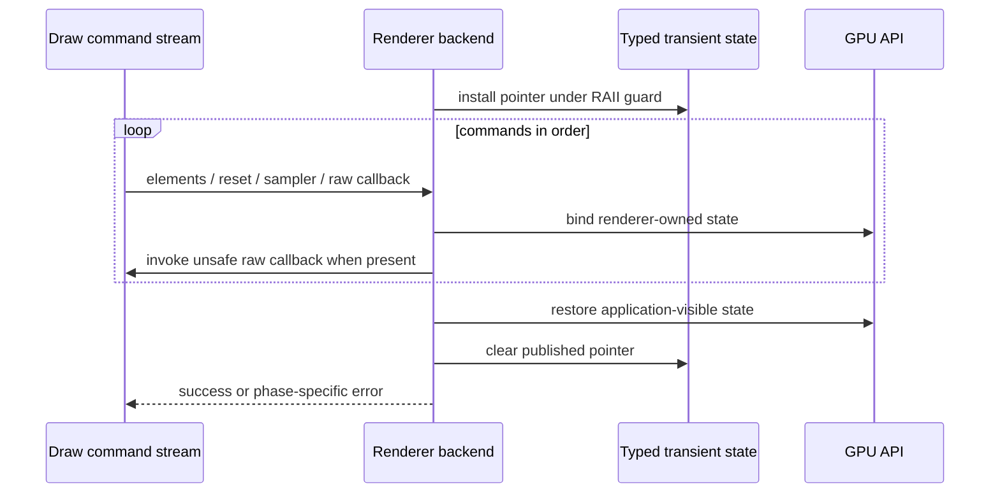
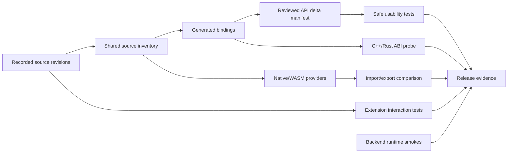

# 0.16 Release Contract Hardening and Renderer Parity - Plan

## Goal Capsule

- **Objective:** Finish the Dear ImGui 1.92.9 upgrade as a coherent safe-Rust, frame-presentation, renderer-state, extension, and release-evidence contract instead of shipping a collection of bindings that compile but differ silently by backend.
- **Authority:** Vendored Dear ImGui 1.92.9 docking sources, its official OpenGL3/Vulkan backends, the matching Dear ImGui Test Engine sample, and the repository's existing Context/renderer-consumer ownership model are authoritative. A generated C declaration is evidence of availability, not evidence that a safe Rust abstraction exists.
- **Execution profile:** Remove false-safe and sentinel-based core APIs first; make presentation and surface admission explicit second; establish one callback/render-state contract third; then align WGPU, Glow, and Ash, harden WASM and upgrade evidence, resolve extension source drift, and close documentation/release gates.
- **Stop conditions:** Stop and re-plan if a proposed safe API requires a Rust-owned callback allocation whose destruction cannot be guaranteed, if a skipped frame must be reported as presented, if an external texture must be permanently mutated to render it, if Ash resource retirement would occur before GPU completion, or if a release gate would require a compiler from prebuilt consumers that currently promise not to need one.
- **Tail ownership:** This plan owns core and backend breaking changes, Test Engine and dear-app integration, first-party examples, binding/provider tooling, extension source pins, CI/release evidence, migration docs, and the 0.16 changelog. It does not publish crates or merge a PR without the normal repository release workflow.

---

## Product Contract

### Summary

The 0.16 release must give users the same truthful contract on every supported renderer. A safe method must either complete its documented behavior or reject the operation before taking ownership. A graphical Test Engine frame must distinguish rendering from actual presentation. A renderer may temporarily bind its own state, but it must not leak ownership changes into application textures or hide backend capability differences. Upstream upgrades must produce evidence for declarations, layouts, providers, runtime behavior, and extension source compatibility rather than relying on symbol counts alone.

This is deliberately a breaking cleanup. The version is still prerelease, and preserving APIs whose type model contradicts upstream semantics would move the migration cost onto every future release.

### Problem Frame

The current branch exposes several contracts that compile while encoding the wrong state or ownership model:

- `add_callback_safe` transfers a boxed closure to a native draw command, but WGPU and Ash silently skip raw callbacks. The closure then neither runs nor gets reclaimed.
- table column `UserID` values are modeled as optional non-zero widget IDs even though upstream treats them as opaque `ImGuiID` data and permits zero.
- `TextNoPixelSnap` is visible as a flag but cannot be applied through a panic-safe scoped API.
- ini retention accepts a month count unrelated to the representable packed session date and can drive upstream month subtraction outside its valid year range.
- Test Engine's graphical runner cannot place `PreSwap` and `PostSwap` around the real present operation; dear-app may open and render a frame before discovering that no surface image can be acquired.
- WGPU publishes render state but skips raw callbacks, Glow mutates application texture filtering on every draw, and Ash lacks the official split image/sampler and transient render-state contract.
- the WASM provider path can drift from the source resolver used by native builds, while current CI checks Rust imports without proving that an actual provider exports them.
- API auditing snapshots function declarations but does not force a reviewed decision for fields, enums, constants, extension changes, ABI layouts, or safe-layer usability.
- nested ImGuizmo and imnodes revisions can lag fixes even when their cimgui wrapper repositories appear current.

These are one architectural class of bug: an upstream capability was surfaced without assigning lifecycle ownership and observable proof to the layer that claims it is supported.

### Actors

- A1. A core crate user configuring tables, ini retention, and draw-list text behavior through safe Rust.
- A2. A custom renderer author consuming raw draw callbacks and `Renderer_RenderState` under a Context-owned frame lease.
- A3. A WGPU, OpenGL, or Vulkan application integrating external textures whose sampling state is application-owned.
- A4. A Test Engine user running either headless tests or graphical tests around a real swapchain presentation.
- A5. A dear-app user experiencing surface loss, occlusion, timeout, resize, or recovery.
- A6. A WASM consumer expecting checked-in imports and the linked C/C++ provider to agree.
- A7. A maintainer upgrading cimgui, Dear ImGui, Test Engine, or extension wrappers and deciding which upstream changes need a safe Rust API.
- A8. A prerelease adopter migrating from the current 0.16 alpha API and relying on examples and changelog guidance.

### Key Flows

- F1. Configure a table column with any opaque 32-bit user value, including zero, and receive exactly that value in sort specifications.
- F2. Enable no-pixel-snap text for a bounded draw-list scope, unwind through a panic or early return, and retain every unrelated draw-list flag.
- F3. Register an unsafe raw draw callback, render it on a supported first-party backend while typed transient render state is installed, and clear that state even if callback-adjacent rendering fails.
- F4. Choose an ini retention policy and a valid session date as one coherent Context configuration; reject combinations that upstream cannot subtract safely.
- F5. Run a graphical Test Engine frame through prepare, UI, render, pre-present, present, and post-present exactly once; run headless mode through an explicitly virtual presentation path.
- F6. Encounter a lost, outdated, timed-out, or occluded surface before opening an ImGui frame; recover or skip without advancing Test Engine presentation state or leaving a live frame.
- F7. Render main and platform WGPU viewports without holding conflicting surface acquisitions, then measure only the real main present between Test Engine swap hooks.
- F8. Render an external OpenGL texture with the default or explicit nearest sampler and observe the original texture parameters unchanged afterwards.
- F9. Render an Ash texture while standard sampler callbacks switch renderer-owned descriptor state, and let an unsafe callback inspect the current command buffer/pipeline state for only that draw scope.
- F10. Regenerate bindings and the WASM provider from the same source inventory, build the provider, and verify that every checked-in import has a matching export.
- F11. Review an upstream delta across declarations, constants, fields, enums, layouts, extensions, and usability, recording an explicit expose/wrap/reject/internal decision before updating the accepted baseline.
- F12. Update extension wrapper and nested source revisions together, or fail with a named external blocker when no wrapper revision can represent the required upstream fix.

### Requirements

#### Safe core semantics

- R1. Remove `DrawListMut::add_callback_safe`, its builder, exports, docs, and examples. No compatibility alias may retain the claim that a Rust closure can be safely transferred to an untyped native command stream.
- R2. Preserve the explicitly unsafe raw callback API. First-party renderers must execute non-standard raw callbacks at the correct command position or return a documented error before draw side effects; silent skipping is forbidden.
- R3. Detached snapshots must continue rejecting raw callbacks because native callback pointers and transient backend state cannot be made portable across threads or epochs.
- R4. Table column user data must be represented as opaque 32-bit data, allow zero, and round-trip without `Option`, non-zero validation, or widget-identity semantics. Rename public fields and builders from `user_id` to `user_data` and delete sentinel helpers and compatibility aliases.
- R5. Provide a scoped, panic-safe draw-list API for `TextNoPixelSnap`. Scope exit must restore only the prior state of that bit and preserve all unrelated flags, including vertex-offset support owned by the renderer contract.
- R6. Do not expose unrestricted safe mutation of native draw-list flags merely to implement R5.
- R7. Model ini retention and session date as Context-owned validated values. A valid date must be Gregorian and fit upstream's packed year representation; year zero and subtraction across the representable lower bound are invalid.
- R8. Automatic-discard month limits must be derived from the configured session date. Setting the policy must be atomic: no call order may temporarily create an invalid raw combination.
- R9. Delete independent setters that permit invalid date/retention combinations. Getters may expose the current validated policy without leaking a mutable raw `ImGuiIO` escape hatch.

#### Frame and presentation protocol

- R10. The Test Engine graphical runner must own an explicit presentation driver contract that separates render work from presentation work and enforces `render -> pre_swap -> present -> post_swap`.
- R11. Headless execution must select an explicit virtual/no-surface presentation mode. It may advance required Test Engine hooks, but it must not be confused with evidence that an OS swapchain was presented.
- R12. Presentation failures must be typed with the phase that failed. A failed present must not call `post_swap`; shutdown must still leave the Test Engine and Context in a deterministic terminal state.
- R13. dear-app must acquire or recover the main surface before opening an ImGui frame. Lost/outdated recovery may retry once under the existing policy; timeout/occlusion skips the frame without UI, renderer, or Test Engine advancement.
- R14. Once a dear-app frame opens, every normal path must finish rendering and either complete the presentation protocol or return a phase-specific terminal error. No early return may strand an open frame.
- R15. Surface admission and recovery logic must be injectable in tests so success, suboptimal, lost, outdated, timeout, occluded, validation, and out-of-memory paths are covered without relying only on a live GPU.
- R16. WGPU multi-viewport must not hold one acquired surface while acquiring or presenting another in an order rejected by Vulkan WSI. Platform windows must complete before the main Test Engine swap interval, and `pre_swap`/`post_swap` must bracket only the main present.
- R17. Add a successful end-to-end Test Engine table resize-by-label case against a real resizable table, in addition to existing rejection tests.

#### Renderer callback and resource ownership

- R18. Define one backend callback contract: install typed transient render state for a draw scope, execute reset/sampler/raw callbacks in command order, restore state through RAII, and clear the published pointer before the scope ends.
- R19. Render-state types must expose only resources valid for the callback duration. They must not grant ownership, outlive the render pass/command buffer, or become a route to mutable Context state.
- R20. WGPU must execute raw callbacks in both direct and renderer-owned render paths while its existing typed state is live. Unsupported callback circumstances must fail before consuming callback-bearing draw data.
- R21. Glow must create and own linear and nearest sampler objects whenever runtime capability permits, remove the `bind_sampler_support` compile-time feature, and switch samplers only through standard callback commands.
- R22. Glow's fallback path must be explicit and fully restorative. If texture parameters are temporarily changed because sampler objects are unavailable, the original external texture parameters must be restored before the draw scope ends.
- R23. Glow must publish typed transient render state and restore every GL binding or parameter it changes, including callback-driven sampler state.
- R24. Ash must split sampled-image and sampler descriptor bindings, own standard linear/nearest samplers and their descriptor sets, and implement standard sampler callbacks without per-texture sampler ownership.
- R25. Ash external texture APIs must describe sampled-image ownership truthfully. Remove combined-image-sampler names or constructors that imply the renderer owns an application sampler when it does not.
- R26. Ash must publish typed transient command-buffer, pipeline, and layout state, execute unsafe raw callbacks in command order, and restore the renderer pipeline after reset callbacks.
- R27. Ash shader sources, generated SPIR-V, descriptor layouts, pool accounting, texture updates, multi-viewport paths, and teardown must migrate as one transaction. GPU resources may retire only after the existing fence/device-idle contract proves completion.
- R28. Renderer setup, failure rollback, Context reset, device recreation, and destruction must install and remove callbacks, samplers, descriptor state, and render-state pointers symmetrically.

#### Upgrade and release evidence

- R29. Define one checked-in, machine-readable maintained-source inventory and consume it through Rust and Python readers so native builds, binding generation, archive inventory, and WASM provider construction resolve the same canonical and explicitly supported alternate paths.
- R30. Build an actual WASM C/C++ provider in CI and compare its exports with checked-in Rust imports for core and maintained extensions. `ImGuizmo_ComputeMouseRay` and every newly accepted symbol must be part of that proof.
- R31. Replace the function-only upgrade audit with a reviewed delta manifest covering functions, constants, enums, fields, typedefs, layouts, and maintained extensions. Every addition/change must receive an explicit safe alias, safe wrapper, raw-only/rejected rationale, or internal classification.
- R32. Updating the accepted upstream baseline must fail while any delta decision is missing or while a claimed safe exposure lacks a compile/runtime usability test appropriate to its contract.
- R33. Add CI-only native C++ layout probes for changed public aggregates, including `ImDrawData`, `ImTextureData`, and `ImGuiPlatformIO`, and compare `sizeof`, alignment, and selected `offsetof` values with Rust. Do not add a compiler requirement to prebuilt consumers.
- R34. Expand runtime evidence with callback execution/cleanup, dear-app graphical presentation/recovery, WGPU swap-hook ordering, real GL external-texture state restoration, and Vulkan validation-layer Ash smoke coverage.
- R35. Extend `compute_mouse_ray` tests to perspective, reverse-Z, infinite-far, and singular-matrix cases with finite/error outcomes derived from upstream behavior.
- R36. Resolve ImGuizmo and imnodes nested-source drift before release. Prefer an upstream wrapper revision; otherwise use a repository-owned, documented direct-source pin or source overlay with provenance and interaction regressions. Silently retaining a known-bad nested pin is not acceptable.
- R37. Keep all new repository orchestration cross-platform Python except workflow-native shell fragments that are strictly CI-specific.
- R38. Update examples, README/backend docs, migration notes, and the concise 0.16 changelog to describe deletions, replacements, backend guarantees, and the distinction between headless and graphical evidence.

### Acceptance Examples

- AE1. Given table user data `0`, `1`, and `u32::MAX`, when columns are configured and sorted, then each raw value is returned unchanged and no value is interpreted as automatic or absent.
- AE2. Given `TextNoPixelSnap` was initially off and another draw-list flag was on, when a scoped no-pixel-snap closure panics, then the text bit returns to off and the unrelated flag remains on.
- AE3. Given callback-bearing draw data, when WGPU, Glow, or Ash renders it, then the raw callback runs once at its command position with non-null backend-appropriate transient state; when snapshot creation is attempted, it is rejected before detachment.
- AE4. Given an attempted safe closure callback registration, compilation fails because the false-safe API no longer exists and migration guidance points to renderer-native work or an explicitly unsafe raw callback.
- AE5. Given session date `2001-01-01`, when a retention policy would subtract into year 2000 or below, then configuration is rejected without mutating raw IO. Given a later date and an in-range month count, both raw fields update together.
- AE6. Given a graphical Test Runner driver, observed events are UI, render, pre-swap, present, post-swap. Given present failure, post-swap is absent and the error names the presentation phase.
- AE7. Given dear-app surface timeout or occlusion, no ImGui frame or Test Engine swap hook occurs. Given lost/outdated, recovery precedes the one admitted UI frame.
- AE8. Given main and secondary WGPU viewports, no two live acquisitions violate WSI ordering and Test Engine measures only the successful main present between its hooks.
- AE9. Given an application-owned OpenGL texture with mipmapped filtering, rendering it through ImGui leaves its min/mag parameters identical afterwards; explicit nearest sampling affects only the ImGui draw.
- AE10. Given one Ash sampled image, linear and nearest commands bind renderer-owned sampler set 1 while image set 0 remains stable, and validation layers report no descriptor, lifetime, or dynamic-rendering errors across viewport creation and teardown.
- AE11. Given a modified generator declaration, enum, field, layout, or extension pin without a delta decision, the upgrade gate fails with the exact undecided item. Adding only a raw binding does not satisfy a claimed safe exposure.
- AE12. Given the checked-in WASM imports, the CI-built provider exports the same maintained symbol set and fails when the ImGuizmo source path or one export is removed.
- AE13. Given a changed aggregate layout, the native probe compares C++ and Rust size/alignment/offset evidence while a prebuilt no-compiler consumer still builds through its existing route.
- AE14. Given current ImGuizmo and imnodes interaction regressions, maintained examples/tests exercise multi-gizmo state and focus/pan/box-select behavior against the recorded nested revisions.
- AE15. Given a prerelease user reading the 0.16 changelog, they can identify the removed APIs, direct replacements, renderer behavior changes, and graphical verification examples without reading the internal implementation history.

### Scope

**In scope**

- Core table, draw-list, ini/session-date, and callback surface corrections.
- Test Engine runner and dear-app frame/presentation redesign.
- WGPU, Glow, and Ash callback/render-state/sampler parity.
- First-party multi-viewport and graphical Test Engine examples.
- Build-support, xtask, Python release tools, CI workflows, ABI/provider/runtime gates.
- Maintained extension source revisions and interaction coverage.
- Root changelog, migration guidance, backend docs, examples, and release evidence.

**Out of scope**

- A new safe abstraction for arbitrary renderer-native user callbacks; deletion is correct until ownership can be guaranteed across all consumers.
- Making native draw callbacks portable in detached snapshots.
- Redesigning SDL3 or Winit platform backends when review finds no corresponding 1.92.9 contract defect.
- Publishing crates, tagging a release, or changing the established same-SHA publication workflow.
- Requiring every GPU runtime test on every developer machine; CI remains authoritative for hardware/driver matrices.

### Assumptions

- The current `upgrade/imgui-1.92.9` branch is the implementation base until its work is merged or rebased by explicit user direction.
- Dear ImGui 1.92.9 and the vendored matching Test Engine are fixed inputs for this plan; new upstream commits discovered during execution require a deliberate pin decision rather than silent scope growth.
- The existing Context activation, renderer-consumer epoch, managed-texture retirement, and prebuilt no-compiler contracts remain valid unless a unit produces contradictory evidence.
- GitHub CI may be used as the authoritative graphical/platform matrix when targeted local tests are impractical; local Cargo commands remain serial and reuse the normal `target` directory.
- Extension wrapper availability is external. A missing suitable wrapper revision is a stop condition for that source update, not permission to mark the requirement complete without a repository-owned alternative.

---

## Planning Contract

### Key Technical Decisions

- KTD1. Treat unpublished 0.16 APIs as removable when their types encode a false safety, identity, or ownership contract; do not preserve compatibility aliases. (session-settled: user-directed - chosen over minimal fixes and deprecation shims because the user explicitly authorized breaking deletion before release.)
- KTD2. Finish every known release-contract defect in this plan rather than defer backend parity or evidence gaps to a later release. (session-settled: user-directed - the user explicitly requested that every reviewed issue receive the correct architectural fix.)
- KTD3. Prefer lifecycle truth over convenience: safe ownership transfer requires a guaranteed destruction path, presentation hooks require a real or explicitly virtual presentation boundary, and external GPU state remains owned by the application.
- KTD4. Delete the safe Rust closure callback API and keep raw callbacks unsafe. A backend-level capability type cannot repair native command-stream abandonment or detached-snapshot portability without a new owned command representation.
- KTD5. Put date/retention validation on `Context`, not independently mutable `Io`, because the invariant spans two raw fields and upstream performs arithmetic using both.
- KTD6. Use a first-class Test Engine frame/presentation driver rather than two unrelated closures. One driver owns acquisition, render, present, and phase errors, which prevents borrow conflicts and makes the valid order unrepresentable by ordinary callers.
- KTD7. Admit a dear-app frame only after surface acquisition/recovery. Skipped surfaces produce no frame rather than fabricating swap completion after rendering work that cannot be presented.
- KTD8. Standardize renderer callbacks around typed, transient, RAII-installed backend state. The core defines ordering and safety constraints; concrete state types stay backend-owned.
- KTD9. Use runtime OpenGL sampler capability with renderer-owned objects and a restorative fallback. A feature flag cannot truthfully describe the active context, and unconditional texture mutation violates external ownership.
- KTD10. Align Ash with upstream's two-set sampled-image/sampler model. Keeping combined descriptors would make standard sampler callbacks impossible or require rebuilding application texture descriptors during a draw.
- KTD11. Make source discovery and accepted upstream delta data shared, language-neutral build inputs. Repeating path logic across Rust and Python, or treating generated snapshots as review evidence, allows providers and safe wrappers to drift independently.
- KTD12. Keep native ABI probes in CI/release tooling only. This strengthens source builds without breaking the prebuilt route's no-compiler promise.
- KTD13. Resolve extension nested-pin drift with provenance and interaction tests, preferring upstream wrapper commits but permitting a repository-owned direct-source pin or overlay when wrappers cannot represent required fixes. The fallback must not require an unapproved external repository mutation.
- KTD14. Use serial implementation and Cargo verification in the shared worktree; subagents may perform bounded read-only analysis or disjoint edits but the primary agent integrates, tests, and commits each dependency boundary. (session-settled: user-directed - chosen to respect the machine's concurrent Codex load while still using requested subagent review.)

### High-Level Technical Design

The diagrams are contract sketches, not prescribed Rust signatures.

#### Frame admission and presentation

#### Renderer callback scope

#### Upgrade evidence pipeline

### Dependency Order

1. U1 and U2 establish truthful core values and eliminate the unreclaimable safe callback surface.
2. U3 defines presentation semantics before U4 moves dear-app and WGPU multi-viewport onto them.
3. U5 defines the shared renderer callback rules and completes WGPU, providing the reference for U6 and U7.
4. U6 and U7 can be implemented independently but are integrated and tested serially.
5. U8 centralizes source/provider inputs before U9 expands the upgrade and release gates.
6. U10 resolves extension drift and closes docs/release evidence only after the earlier public contracts stabilize.

---

## Implementation Units

### Unit Index

| Unit | Name | Primary requirements | Depends on |
|---|---|---|---|
| U1 | Truthful core identifiers and draw-list scopes | R4-R6, R17 | - |
| U2 | Context-owned ini retention invariants and callback deletion | R1-R3, R7-R9 | U1 |
| U3 | Explicit Test Engine presentation driver | R10-R12, R17 | U2 |
| U4 | dear-app surface admission and WGPU viewport timing | R13-R16 | U3 |
| U5 | Shared renderer callback contract and WGPU completion | R18-R20, R28 | U2 |
| U6 | Glow sampler and external-state ownership | R21-R23, R28 | U5 |
| U7 | Ash sampled-image/sampler architecture | R24-R28 | U5 |
| U8 | Shared source discovery and real WASM provider | R29-R30, R37 | U2 |
| U9 | API, ABI, usability, and runtime evidence gates | R31-R35 | U3-U8 |
| U10 | Extension drift, migration, and release closure | R36-R38 | U9 |

### U1. Truthful Core Identifiers and Draw-List Scopes

- **Goal:** Correct table user-data semantics and make `TextNoPixelSnap` usable without exposing unrestricted flag mutation.
- **Requirements:** R4-R6, R17; flows F1-F2; acceptance AE1-AE2.
- **Files:** `dear-imgui/src/widget/table/{setup,builder,core,sort,validation,tests}.rs`, `dear-imgui/src/draw/{counts,list}.rs`, `dear-imgui/src/draw/list/{text,tests}.rs`, `extensions/dear-file-browser/src/ui/file_table.rs`, table examples, Test Engine table tests.
- **Approach:** Replace optional `Id` fields/builders with opaque user-data values and remove non-zero/sentinel helpers. Introduce a draw-list token/closure following existing texture/style token patterns; capture and restore only the text-no-pixel-snap bit. Migrate repository callers directly to the new names.
- **Test scenarios:** Round-trip zero, one, and maximum user data through setup and sort specs; compile-fail old field/builder names; nested no-pixel-snap scopes; initially-on and initially-off states; panic restoration while an unrelated flag changes; successful Test Engine resize-by-label against a real table.
- **Verification:** Core unit/integration/doc tests observe opaque round-trip and scope restoration; repository search finds no old `user_id` table surface or optional-user-id helper outside upstream/sys bindings.
- **Execution note:** Update the existing sentinel tests first and observe their old expectations fail before changing production code.

### U2. Context-Owned Ini Retention Invariants and Callback Deletion

- **Goal:** Remove the unreclaimable safe callback surface and make ini retention/date arithmetic valid by construction.
- **Requirements:** R1-R3, R7-R9; flows F3-F4; acceptance AE3-AE5.
- **Files:** `dear-imgui/src/draw/{callback,list}.rs`, `dear-imgui/src/draw/list/raw.rs`, `dear-imgui/src/lib.rs`, `dear-imgui/src/io/settings.rs`, `dear-imgui/src/platform_io/core.rs`, Context settings/configuration modules, IO/PlatformIO/core compile-fail tests, examples/docs referencing callbacks or ini retention.
- **Approach:** Delete the safe callback builder/module and its WASM special case; retain and sharpen the unsafe raw callback contract. Introduce validated session-date and retention policy values owned and atomically applied by Context. Remove independent mutable IO setters and document representable Gregorian boundaries and dynamic month limits.
- **Test scenarios:** Compile-fail safe callback usage; raw callback remains explicitly unsafe; snapshot rejects callback-bearing data; earliest/latest valid dates; leap-day validation; zero/invalid packed dates; month subtraction at and across the lower bound; failed policy update leaves both raw fields unchanged; call-order cannot produce an invalid pair.
- **Verification:** Normal and compile-fail tests show no Rust-owned callback allocation remains in native draw commands; API docs expose one Context policy entry point; repository search finds no `Box::into_raw` callback builder and no independent retention mutators.
- **Execution note:** Characterize current raw-field mutation and invalid boundary behavior before replacing the API.

### U3. Explicit Test Engine Presentation Driver

- **Goal:** Make Test Engine graphical and headless frame completion semantically explicit and correctly ordered.
- **Requirements:** R10-R12, R17; flows F5; acceptance AE6.
- **Files:** `extensions/dear-imgui-test-engine/src/{runner,engine,error,state}.rs`, `extensions/dear-imgui-test-engine/tests/{runner,settings_lifecycle}.rs`, test-engine examples and README/rustdoc.
- **Approach:** Replace the single renderer closure with a frame driver/presenter abstraction that owns render and present phases. Keep the swap hooks under the runner's control so callers cannot invert or omit them. Represent headless as an explicit virtual presenter and preserve terminal-summary behavior on all phase errors.
- **Test scenarios:** Exact graphical event order; virtual headless order and evidence label; render, pre-swap, present, and post-swap failures; present failure omits post-swap; repeated/invalid direct hook use is rejected or no longer public; successful label-based table resize; engine teardown after every failure phase.
- **Verification:** Test logs prove the only successful graphical sequence is UI/render/pre/present/post; no public runner API can place present outside the swap-hook pair.
- **Execution note:** Rewrite existing ordering tests to the desired sequence and observe them fail against the current runner first.

### U4. dear-app Surface Admission and WGPU Viewport Timing

- **Goal:** Prevent frames without presentable surfaces and align multi-viewport work with WSI and Test Engine timing.
- **Requirements:** R13-R16; flows F6-F7; acceptance AE7-AE8.
- **Files:** `dear-app/src/runtime/{runner,recovery,state,lifecycle}.rs`, `dear-app/src/application.rs`, dear-app tests or new runtime test module, `examples/02-docking/multi_viewport_wgpu.rs`, WGPU viewport runtime tests, graphical Test Engine example/gate.
- **Approach:** Split redraw into surface admission, admitted frame, and presentation phases. Move acquisition/recovery before platform/UI preparation and expose an injectable acquisition seam for deterministic tests. Reorder the WGPU example/runtime so platform-window rendering completes without a conflicting main acquisition, then acquire/render/present main and bracket only that present with Test Engine hooks.
- **Test scenarios:** Every WGPU surface result and one-retry recovery path; no UI/hooks on skip; no stranded frame on render/present errors; suboptimal reconfigure after present; main and secondary viewport ordering; held-drag smoke; Vulkan WSI smoke reports no acquire/present validation errors.
- **Verification:** Deterministic tests prove admission behavior and phase order; graphical runtime evidence records viewport lifecycle plus hook order; no main surface lease spans secondary acquisition in the validated route.
- **Execution note:** Preserve a characterization test for current recovery policy, then move the admission boundary without broadening retry behavior.

### U5. Shared Renderer Callback Contract and WGPU Completion

- **Goal:** Establish one callback/render-state lifecycle and make WGPU honor every accepted draw command.
- **Requirements:** R18-R20, R28; flows F3; acceptance AE3.
- **Files:** core draw-command documentation/tests, `backends/dear-imgui-wgpu/src/{data.rs,renderer/{draw,render,state,callbacks,lifecycle,core}.rs}`, WGPU renderer tests and snapshot contract tests.
- **Approach:** Document the backend callback invariants in core and encode reusable guard patterns where ownership is genuinely shared. Make both WGPU draw paths preflight callback-bearing data, install typed state, execute raw callbacks, restore pipeline state as required, and clear the published pointer on success and error.
- **Test scenarios:** Callback execution count/order; non-null correctly typed state during callback and null afterwards; reset followed by elements; sampler callbacks around one texture; unsafe callback documentation requires non-unwinding behavior; both direct and owned render paths; snapshot rejection occurs before detachment.
- **Verification:** WGPU tests contain no silent raw-callback branch; transient-state RAII tests cover early return; callback-bearing frames either render once or fail before draw side effects.

### U6. Glow Sampler and External-State Ownership

- **Goal:** Align OpenGL sampling with upstream while leaving application textures and GL state unchanged.
- **Requirements:** R21-R23, R28; flows F8; acceptance AE9.
- **Files:** `backends/dear-imgui-glow/Cargo.toml`, `src/{state,versions,renderer/{device,draw,init,callbacks,texture}.rs}`, GL runtime tests/examples and backend docs.
- **Approach:** Remove the compile-time sampler feature, detect support from the live GL context, create linear/nearest samplers transactionally, and publish typed render state. Use standard callbacks to switch renderer-owned samplers. For contexts without sampler objects, snapshot and restore external texture filter parameters only when an explicit sampler callback requires a fallback mutation.
- **Test scenarios:** Runtime capability present/absent; init failure rollback; external mipmapped and nearest textures retain parameters; standard sampler commands affect only the intended draw; raw callback sees state; all bindings/state restored after normal, callback, and error paths; teardown and recreation delete each sampler once.
- **Verification:** A real GL test reads texture parameters before and after rendering; feature-matrix checks prove the obsolete feature is gone; state guard tests cover all modified bindings.
- **Execution note:** Add a failing external-texture state regression before replacing unconditional `glTexParameteri` calls.

### U7. Ash Sampled-Image/Sampler Architecture

- **Goal:** Implement the full Vulkan 1.92.9 renderer contract with truthful texture ownership and fence-safe resources.
- **Requirements:** R24-R28; flows F9; acceptance AE10.
- **Files:** `backends/dear-imgui-ash/src/renderer/{vulkan,texture,pipeline,shaders,draw,context_state,callbacks,lifecycle,retirement,tests}.rs`, viewport renderer modules, public `texture.rs`, shader sources and generated shader artifacts, Ash examples/docs.
- **Approach:** Migrate the pipeline to image set 0 and sampler set 1; make texture records own image-view/layout descriptors rather than samplers; create renderer-owned standard samplers/sets; publish typed transient render state; execute standard and raw callbacks; update reset/rebind behavior, descriptor accounting, managed-texture updates, multi-viewport rendering, and retirement together.
- **Test scenarios:** Layout and pool creation rollback; external and managed texture create/update/destroy; linear/nearest switching without image-set churn; raw callback state and reset; stale/foreign texture rejection; device recreation; fence-delayed sampler/layout retirement; dynamic rendering and platform viewport validation-layer smoke.
- **Verification:** Shader/layout reflection agrees with two descriptor sets; unit tests cover ownership and rollback; validation layers report no descriptor, lifetime, render-state, or WSI errors through create/render/resize/destroy.
- **Execution note:** Treat shader, descriptor, public texture API, and teardown changes as one atomic unit; do not commit a partially compatible pipeline.

### U8. Shared Source Discovery and Real WASM Provider

- **Goal:** Eliminate source-path drift and prove the linked WASM provider implements checked-in imports.
- **Requirements:** R29-R30, R37; flows F10; acceptance AE12.
- **Files:** `tools/build-support/src/lib.rs`, `xtask/src/main.rs`, sys-crate build scripts, `tools/ci/{_archive,_source_packages,release_cell}.py`, provider/generation tests, release workflow.
- **Approach:** Define one checked-in source inventory with strict Rust and Python readers, then consume it from build-support, generation, provider, and archive paths. Remove the stale ImGuizmo path duplication. Add a CI provider build using the existing supported toolchain, extract exports structurally, and compare them with Rust import declarations for core and maintained WASM extensions.
- **Test scenarios:** Canonical and allowed legacy resolution; missing/ambiguous source diagnostics; stale ImGuizmo path regression; deterministic inventory; missing provider export; unexpected import module; `ComputeMouseRay` export; packaged-source provider build.
- **Verification:** One inventory drives every path; CI compiles and inspects the actual provider rather than only checking Rust; Python/Rust tool tests fail predictably on a removed source or export.

### U9. API, ABI, Usability, and Runtime Evidence Gates

- **Goal:** Turn future upstream upgrades into a reviewed, reproducible decision process across syntax, layout, safe usability, and runtime behavior.
- **Requirements:** R31-R35; flows F11; acceptance AE11-AE13.
- **Files:** `tools/api_surface_report.py`, policy/snapshot or replacement decision manifests, generator JSON consumers, new ABI-probe tooling, `tools/pre_publish_check.py`, `tools/ci/{release_cell,release_evidence,_runtime_gate}.py`, release workflow and tool tests.
- **Approach:** Expand upstream inventory to declarations, constants, enums, fields, typedefs, layouts, and maintained extensions. Store decisions separately from generated facts and require reviewed status plus evidence references. Compile a focused C++ layout probe in source-build CI and compare structured results with Rust. Add graphical/runtime evidence categories for presentation, callbacks, GL state, Ash validation, and mouse-ray numerical boundaries.
- **Test scenarios:** Added/removed/changed item in every inventory class; missing/invalid/stale decision; safe claim without evidence; layout size/alignment/offset mismatch; prebuilt route remains compiler-free; runtime evidence omitted or stale; perspective/reverse-Z/infinite/singular mouse rays.
- **Verification:** An intentional fixture drift fails with an actionable item path and required decision; source CI catches ABI mismatch; release evidence cannot pass by presenting only binding hashes or headless tests.
- **Execution note:** Preserve existing snapshots as generated facts where useful, but do not reinterpret them as approval records.

### U10. Extension Drift, Migration, and Release Closure

- **Goal:** Resolve known nested-source regressions and leave a concise, executable prerelease migration surface.
- **Requirements:** R36-R38; flows F12; acceptance AE14-AE15.
- **Files:** extension submodule gitlinks/metadata, extension build-support inputs, ImGuizmo/imnodes tests and examples, `CHANGELOG.md`, README/backend/custom-backend docs, upgrade skill instructions, release metadata and checks.
- **Approach:** Inspect wrapper remotes and select revisions that carry required nested fixes. If none exist, use the KTD13 repository-owned path and record provenance. Regenerate affected bindings from the chosen sources, add interaction regressions, migrate all examples, and rewrite the 0.16 changelog around user-visible migration and guarantees rather than implementation chronology. Update the upgrade skill so future runs require the new delta/provider/ABI evidence.
- **Test scenarios:** Multi-gizmo state independence; imnodes focus/pan/box-select behavior; regenerated binding determinism; clean source-package build; old public APIs fail with migration pointers; documented examples compile/run under their advertised features; release metadata and changelog version agree.
- **Verification:** Recursive submodule status matches recorded provenance; extension interaction tests pass; docs contain no removed APIs; prerelease release gate assembles complete evidence and no known reviewed defect remains unclassified.

---

## System-Wide Impact

### Public API and migration

- Core breaking changes affect draw callbacks, table column setup/sort specs, and ini retention configuration.
- Test Engine graphical callers move from a renderer-only closure to a presentation driver; headless callers explicitly select virtual presentation.
- Ash external texture registration changes from combined image/sampler semantics to sampled-image semantics.
- Glow loses an obsolete feature flag; behavior becomes runtime capability-driven.
- Examples and changelog must give direct before/after migration mappings without retaining aliases that keep old semantics alive.

### Lifecycle and failure propagation

- Callback state exists only inside a renderer draw scope and is cleared by RAII on every exit.
- Surface errors are handled before Context frame admission; phase-specific errors propagate only after a frame is legitimately opened.
- Test Engine `post_swap` proves completed presentation, not merely attempted rendering.
- Ash descriptor/sampler destruction remains tied to fence/device-idle retirement, never CPU command encoding.
- Provider/build failures identify the source inventory entry or missing export rather than failing later at WASM instantiation.

### Performance and compatibility

- Renderer-owned samplers avoid repeated per-draw texture mutation and descriptor churn.
- The additional upgrade gates run in CI/release workflows, not in ordinary consumer builds.
- GPU validation smokes remain targeted to avoid multiplying local build load; ordinary unit and compile checks stay serial.
- Removing false compatibility now reduces permanent branching in all renderers and examples.

### Documentation and support

- `CHANGELOG.md` remains user-facing and concise; detailed architectural rationale belongs in migration/backend docs and this plan.
- Custom backend documentation must state the callback ordering, transient-state, sampler, external-resource, and presentation requirements.
- Test Engine docs must label headless evidence separately from real presentation evidence.
- The repository upgrade skill becomes the maintainer entry point for source inventory, delta decisions, binding generation, provider exports, ABI probes, extension drift, and release evidence.

---

## Verification Contract

### Per-Unit Evidence

| Unit | Required observable evidence |
|---|---|
| U1 | Opaque table values round-trip including zero; scoped text flag restores only its bit; real table resize-by-label succeeds. |
| U2 | Removed safe callback is compile-fail; no boxed callback transfer remains; date/retention boundary and atomicity tests pass. |
| U3 | Event logs prove graphical and virtual-present sequences; every phase failure has deterministic teardown. |
| U4 | Injected surface outcomes prove admission/skip/recovery; WGPU graphical evidence proves WSI-safe viewport and hook order. |
| U5 | Both WGPU paths execute raw callbacks once with live typed state and clear state afterwards. |
| U6 | Real GL readback/query proves application texture parameters and global bindings are restored. |
| U7 | Two-set descriptor tests and Vulkan validation smoke prove sampler callbacks, raw state, viewports, and retirement. |
| U8 | Actual WASM provider build/export comparison passes from the shared source inventory. |
| U9 | Fixtures prove every delta class, ABI mismatch, missing usability evidence, and missing runtime evidence fail closed. |
| U10 | Extension interaction regressions, regenerated bindings, docs/examples, and full prerelease evidence pass. |

### Required Gates

- Focused nextest suites for each touched core/backend/extension crate, run serially.
- Core and backend rustdoc tests, including compile-fail migration contracts.
- Workspace formatting and targeted clippy/check feature matrices, including no-default, multi-viewport, WASM, prebuilt, and maintained extensions.
- Python tool unit tests and workflow semantic tests.
- Deterministic binding regeneration and clean-tree comparison for every affected profile.
- Actual WASM provider/export gate.
- Native C++/Rust aggregate layout probe in compiler-equipped CI plus unchanged prebuilt consumer checks.
- Graphical dear-app/Test Engine present-recovery evidence.
- WGPU multi-viewport smoke with Test Engine hook-order payload.
- Real OpenGL external-texture state test.
- Ash Vulkan validation-layer dynamic-rendering/multi-viewport smoke.
- Packaged-source and release-evidence assembly checks.

### Review Gates

- Run simplification review after core/presentation units and again after renderer/tooling units; remove duplicated state machines, obsolete flags, old adapters, and transitional aliases.
- Run correctness, maintainability, testing, project-standards, API-contract, and adversarial renderer/lifecycle review on the final diff.
- Re-run targeted tests for every accepted review fix; document any residual platform-only risk in the PR and release evidence.
- Verify repository search is clean for deleted public names, stale provider paths, silent callback branches, and old combined-sampler Ash terminology.

---

## Risks and Dependencies

- **Nested extension wrapper lag:** upstream wrapper repositories may not contain commits for the desired nested revisions. Mitigation: prefer a wrapper update, otherwise use the explicit repository-owned provenance path from KTD13; stop rather than silently pin known-bad behavior.
- **Vulkan descriptor migration blast radius:** shader, pipeline, texture API, viewport rendering, and teardown are coupled. Mitigation: U7 is atomic, validation-layer evidence is mandatory, and retirement semantics are reviewed independently.
- **OpenGL capability variance:** sampler objects are unavailable on older contexts. Mitigation: runtime detection plus a parameter-restoring fallback tested on both branches.
- **WGPU cross-surface ordering:** moving swap hooks can reintroduce Vulkan semaphore validation errors. Mitigation: change surface acquisition lifetime, not only hook line order, and require live WSI evidence.
- **Test Engine phase failure:** upstream may require cleanup after missing post-swap during capture. Mitigation: phase-specific tests and deterministic shutdown; do not falsely report a failed present as complete.
- **API gate scope growth:** classifying all historical generator data at once can create noise. Mitigation: bootstrap an explicit accepted baseline, require reviewed decisions for deltas, and keep generated facts separate from approvals.
- **ABI probe portability:** compiler flags and C++ layout output vary by platform. Mitigation: structured numeric output, focused aggregates, compiler-equipped source CI only, and at least Windows MSVC plus one Itanium-ABI platform.
- **Local resource limits:** GPU and workspace gates are expensive. Mitigation: serial Cargo, normal shared `target`, focused local evidence, and authoritative CI matrix for platform-specific gates.

### External Dependencies

- Vendored cimgui/Dear ImGui 1.92.9 docking sources and official renderer backends.
- Matching Dear ImGui Test Engine source and sample presentation order.
- Extension wrapper remotes and nested ImGuizmo/imnodes source history.
- Emscripten/LLVM tooling in CI for the real WASM provider and native ABI probes.
- Available OpenGL, WGPU, and Vulkan validation runners in the repository's existing release infrastructure.

---

## Open Questions

### Resolved During Planning

- **Preserve the safe closure callback as backend-optional?** No. A safe allocation cannot depend on a renderer eventually encountering a native command; delete it under KTD4.
- **Model table user data with `Id` or `Option`?** No. It is opaque upstream data; zero must remain representable under R4.
- **Call swap hooks on skipped or failed surfaces?** No. Surface admission precedes frame creation, and `post_swap` means presentation completed.
- **Keep Glow sampler support as a Cargo feature?** No. Capability belongs to the active GL context and must be detected at runtime.
- **Patch Ash sampler switching inside combined descriptors?** No. The official two-set model is the correct ownership boundary.
- **Make ABI probing part of consumer builds?** No. It is a CI/source-release proof and must preserve prebuilt no-compiler use.
- **Defer known extension nested-pin regressions?** No. Resolve or surface a hard external blocker before declaring the release ready.

### Deferred to Implementation

- The exact public names of the Context retention policy and backend render-state types, provided they preserve R7-R9 and R18-R19 and pass API review.
- Whether the Test Engine driver is one trait or a small set of sealed phase objects, provided ordinary callers cannot misorder presentation.
- The precise WGPU secondary-before-main scheduling mechanism, provided no main acquisition spans secondary WSI work and the measured swap interval remains correct.
- The exact repository-owned extension fallback (direct upstream source pin versus source overlay), determined only after checking current wrapper remotes and license/provenance constraints.
- The ABI probe's initial selected field list beyond the three required aggregates, based on the generated 1.92.9 delta.

---

## Definition of Done

- Every non-deferred requirement R1-R38 is implemented or stopped by a named plan stop condition with evidence; no known review finding is silently omitted.
- U1-U10 each have the required observable evidence and no progress/status text was written into this plan.
- False-safe callback ownership, table sentinel semantics, invalid date arithmetic, and unrestricted flag workarounds are absent from the public API.
- Graphical frame execution has an explicit surface-admission and presentation protocol; headless evidence is clearly labeled virtual.
- WGPU, Glow, and Ash honor the shared callback/render-state contract without silent skips or external-resource ownership violations.
- WASM imports are proven against a built provider, changed native aggregates are layout-probed, and upstream deltas require reviewed decisions plus usability evidence.
- Known extension nested-pin fixes are represented by recorded source provenance and interaction tests.
- Formatting, focused tests, docs, feature matrices, Python tooling, packages, graphical smokes, validation layers, and release evidence pass locally where practical and in authoritative CI otherwise.
- Simplification and multi-lens final review run; eligible findings are fixed and reverified; obsolete code, flags, aliases, paths, and abandoned experiments are deleted.
- `CHANGELOG.md` and migration documentation remain concise, accurate, and sufficient for a 0.16 alpha user to update code without reading internal plans.
