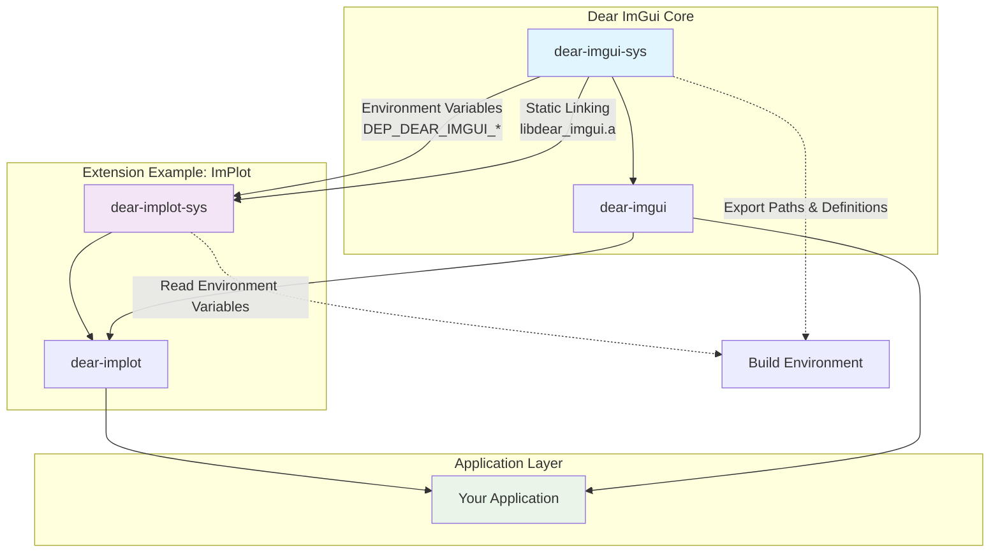

# Dear ImGui Extensions

This directory contains third-party extensions for the `dear-imgui` Rust binding. These extensions provide additional functionality beyond the core Dear ImGui library, such as plotting, 3D manipulation, node editing, and more.

## 🏗️ Architecture Overview

Our extension system uses a hybrid architecture that maintains compatibility with the existing C++ bindgen approach while providing safe, idiomatic Rust APIs.



## 🔧 Key Technical Features

- **Environment Variable Passing**: Through Cargo's `links` mechanism, `dear-imgui-sys` passes build information to dependent crates
- **Static Linking**: Extension `-sys` crates link to Dear ImGui's implementation via `cargo:rustc-link-lib=static=dear_imgui`
- **Header File Sharing**: ImGui header file paths are passed through environment variables to avoid duplication
- **Preprocessor Definition Sharing**: Ensures extensions use the same compilation options as Dear ImGui
- **RAII Safety**: Token-based lifetime management ensures resource safety
- **Type Safety**: Full Rust type system protection with builder patterns

## 📚 Available Extensions

This table lists Dear ImGui extensions compatible with our architecture. We currently maintain **ImPlot** in this repository, and we will continue to maintain this table to include community-developed third-party extensions.

### 🏠 Extensions We Maintain

| Extension | Description | Status | Rust Crate | Original Repository |
|-----------|-------------|--------|------------|-------------------|
| **ImPlot** | Advanced plotting library for scientific/engineering applications | ✅ Complete | [`dear-implot`](./dear-implot) | [epezent/implot](https://github.com/epezent/implot) |

### 🌍 Community Extensions

| Extension | Description | Status | Rust Crate | Original Repository | Maintainer |
|-----------|-------------|--------|------------|-------------------|------------|
| *Coming soon...* | *We welcome community contributions!* | | | | |

> **Note**: Community extensions are maintained by their respective authors. We list them here for discoverability but do not provide official support. Please contact the individual maintainers for issues and questions.

**Legend:**

- ✅ Complete: Fully implemented and tested
- 🚧 Planned: Scheduled for future implementation
- 🔄 In Progress: Currently being developed
- ❌ Blocked: Waiting for dependencies or design decisions

## 🚀 Quick Start

### Using an Extension

Add the extension to your `Cargo.toml`:

```toml
[dependencies]
dear-imgui = { path = "path/to/dear-imgui" }
dear-implot = { path = "path/to/extensions/dear-implot" }
```

Use it in your application:

```rust
use dear_imgui::*;
use dear_implot::*;

fn main() {
    let mut imgui_ctx = Context::create_or_panic();
    let mut plot_ctx = PlotContext::create(&imgui_ctx);

    // In your render loop
    let ui = imgui_ctx.frame();
    let plot_ui = plot_ctx.get_plot_ui(&ui);

    if let Some(token) = plot_ui.begin_plot("My Plot") {
        plot_ui.plot_line("Data", &x_values, &y_values);
        token.end();
    }
}
```

## 🛠️ Creating a New Extension

### Step 1: Set Up the Directory Structure

Create the extension directory structure:

```text
extensions/
└── dear-{extension}/
    ├── Cargo.toml
    ├── README.md
    └── src/
        ├── lib.rs
        ├── context.rs
        └── ...
└── dear-{extension}-sys/
    ├── Cargo.toml
    ├── build.rs
    ├── wrapper.cpp
    ├── wrapper.h
    ├── msvc_blocklist.txt (if needed)
    ├── src/
    │   └── lib.rs
    └── third-party/
        └── {extension}/ (git submodule)
```

### Step 2: Create the `-sys` Crate

The `-sys` crate provides low-level FFI bindings. Here's a template `Cargo.toml`:

```toml
[package]
name = "dear-{extension}-sys"
version = "0.1.0"
edition = "2021"
links = "dear_{extension}"

[dependencies]
dear-imgui-sys = { path = "../../dear-imgui-sys" }

[build-dependencies]
bindgen = "0.70"
cc = "1.0"
```

### Step 3: Implement the Build Script

Create `build.rs` that:

1. Reads Dear ImGui environment variables
2. Compiles the extension's C++ source
3. Links against Dear ImGui's static library
4. Generates Rust bindings

```rust
use std::env;
use std::path::PathBuf;

fn main() {
    // Read Dear ImGui paths from environment variables
    let imgui_include = env::var("DEP_DEAR_IMGUI_INCLUDE_PATH")
        .expect("DEP_DEAR_IMGUI_INCLUDE_PATH not set");
    let imgui_defines = env::var("DEP_DEAR_IMGUI_DEFINES")
        .unwrap_or_default();

    // Set up paths
    let manifest_dir = PathBuf::from(env::var("CARGO_MANIFEST_DIR").unwrap());
    let extension_src = manifest_dir.join("third-party/{extension}");

    // Compile C++ sources
    let mut build = cc::Build::new();
    build
        .cpp(true)
        .include(&imgui_include)
        .include(&extension_src)
        .file("wrapper.cpp")
        .file(extension_src.join("{extension}.cpp"));

    // Add Dear ImGui defines
    for define in imgui_defines.split(',').filter(|s| !s.is_empty()) {
        build.define(define, None);
    }

    // Link against Dear ImGui
    println!("cargo:rustc-link-lib=static=dear_imgui");

    build.compile("dear_{extension}");

    // Generate bindings
    let bindings = bindgen::Builder::default()
        .header("wrapper.h")
        .clang_arg(format!("-I{}", imgui_include))
        .clang_arg(format!("-I{}", extension_src.display()))
        .generate()
        .expect("Unable to generate bindings");

    let out_path = PathBuf::from(env::var("OUT_DIR").unwrap());
    bindings
        .write_to_file(out_path.join("bindings.rs"))
        .expect("Couldn't write bindings!");
}
```

### Step 4: Create the High-Level Rust API

The high-level crate provides safe, idiomatic Rust APIs. Template `Cargo.toml`:

```toml
[package]
name = "dear-{extension}"
version = "0.1.0"
edition = "2021"

[dependencies]
dear-imgui = { path = "../../dear-imgui" }
dear-{extension}-sys = { path = "../dear-{extension}-sys" }
```

Implement safe wrappers following these patterns:

```rust
// Context management
pub struct ExtensionContext {
    // Internal state
}

impl ExtensionContext {
    pub fn create(imgui_ctx: &dear_imgui::Context) -> Self {
        // Initialize extension context
    }

    pub fn get_ui<'ui>(&self, ui: &'ui dear_imgui::Ui) -> ExtensionUi<'ui> {
        ExtensionUi { ui, context: self }
    }
}

// RAII token for resource management
pub struct ExtensionToken<'ui> {
    ui: &'ui dear_imgui::Ui,
}

impl<'ui> ExtensionToken<'ui> {
    pub fn end(self) {
        // Cleanup when token is dropped
    }
}

// Builder pattern for configuration
pub struct ExtensionBuilder {
    // Configuration options
}

impl ExtensionBuilder {
    pub fn new() -> Self { /* ... */ }
    pub fn with_option(mut self, value: T) -> Self { /* ... */ }
    pub fn build(self, ui: &ExtensionUi) -> Option<ExtensionToken> { /* ... */ }
}
```

### Step 5: Add to Workspace

Update the root `Cargo.toml`:

```toml
[workspace]
members = [
    # ... existing members
    "extensions/dear-{extension}-sys",
    "extensions/dear-{extension}",
]
```

### Step 6: Create Examples

Add usage examples in the `examples/` directory:

```rust
use dear_imgui::*;
use dear_{extension}::*;

fn main() {
    let mut imgui_ctx = Context::create_or_panic();
    let mut ext_ctx = ExtensionContext::create(&imgui_ctx);

    // Your example code here
}
```

## 🤝 Extension Development

### 🏗️ Our Approach

We maintain a **selective set of extensions** in this repository that we actively support and maintain. However, we strongly encourage the community to create their own Dear ImGui extensions using the architectural patterns demonstrated here.

### 🎯 Recommended Architecture Pattern

For maximum compatibility and safety, we recommend following this pattern:

```text
your-dear-imgui-extension/
├── your-extension-sys/          # Low-level FFI bindings
│   ├── Cargo.toml              # Links to dear-imgui-sys
│   ├── build.rs                # Reads DEP_DEAR_IMGUI_* env vars
│   ├── wrapper.cpp/.h          # C++ wrapper functions
│   └── src/lib.rs              # Generated bindings
└── your-extension/             # High-level Rust API
    ├── Cargo.toml              # Depends on dear-imgui + your-extension-sys
    └── src/                    # Safe Rust wrappers with RAII
```

### 📋 Key Design Principles

1. **Environment Variable Integration**: Use `DEP_DEAR_IMGUI_INCLUDE_PATH` and `DEP_DEAR_IMGUI_DEFINES`
2. **Static Linking**: Link against Dear ImGui via `cargo:rustc-link-lib=static=dear_imgui`
3. **RAII Safety**: Implement token-based lifetime management
4. **Builder Patterns**: Provide fluent, type-safe configuration APIs
5. **Cross-Platform**: Ensure Windows, macOS, and Linux compatibility

### 🚀 Independent Development

**You don't need to contribute to this repository!** We encourage you to:

- Create your own repository for your extension
- Publish to crates.io with your preferred naming
- Maintain your own release cycle and versioning
- Build your own community around your extension

### 💡 Naming Suggestions

While not required, we suggest these naming patterns for consistency:

- **Crate names**: `your-name-imgui-extension` or `imgui-extension-name`
- **Sys crates**: `your-extension-sys` or `imgui-extension-sys`
- **Repository**: `imgui-extension-rs` or `dear-imgui-extension-rs`

### 📞 Getting Help

- **Study the ImPlot Implementation**: Use `extensions/dear-implot/` as a complete reference
- **Create Issues**: Ask questions about the architecture pattern
- **Community Support**: Help each other in GitHub Discussions

### � Community Extensions

If you create an extension following this pattern, we encourage you to:

- **Submit a PR to add your extension** to our extension table above for better discoverability
- **Share it in Dear ImGui community forums** to reach more users
- **Reference this architectural pattern** in your documentation to help others

We maintain the extension table in this README as a central registry to help users discover compatible extensions. This makes it easier for the community to find and use Dear ImGui extensions that follow our recommended patterns.

## 📖 Additional Resources

- **Dear ImGui Documentation**: [https://github.com/ocornut/imgui](https://github.com/ocornut/imgui)
- **Rust FFI Guide**: [https://doc.rust-lang.org/nomicon/ffi.html](https://doc.rust-lang.org/nomicon/ffi.html)
- **Bindgen Book**: [https://rust-lang.github.io/rust-bindgen/](https://rust-lang.github.io/rust-bindgen/)
- **ImPlot Reference**: See `extensions/dear-implot/` for a complete implementation example

---

**Ready to contribute?** Start by creating an issue to discuss your extension idea, and we'll help you get started! 🚀
