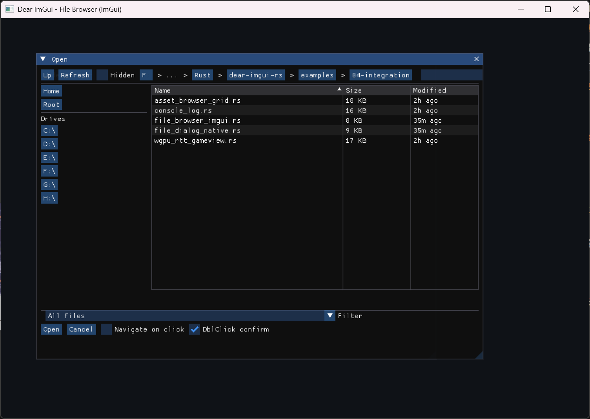

# dear-file-browser

File dialogs and in-UI file browser for `dear-imgui-rs` with two backends:

- Native (`rfd`): OS dialogs on desktop, Web File Picker on WASM
- ImGui UI: a pure Dear ImGui file browser/widget (configurable layout + UX)



## Features

- Backends: `Backend::Auto|Native|ImGui` with runtime selection
- Modes: `OpenFile`, `OpenFiles`, `PickFolder`, `SaveFile`
- Native (rfd): blocking and async APIs (desktop); Web File Picker on WASM
- ImGui (pure UI):
  - Layouts: `Standard` (quick locations + list) or `Minimal`
  - Filters by extension, substring Search, directories-first (configurable)
  - Sorting by Name/Size/Modified via table headers
  - Breadcrumbs with automatic compression on long paths
  - Click behavior for directories: `Select` or `Navigate`
  - Double-click to navigate/confirm (configurable)
  - Keyboard shortcuts: Enter, Backspace, Ctrl+L (path), Ctrl+F (search)
  - Empty-state hint with configurable color/message
  - CJK/emoji supported via user-provided fonts
- Unified `Selection` + `FileDialogError` across backends
- Optional `tracing` instrumentation

## Features (Cargo)

- `imgui` (default): enable the in-UI file browser
- `native-rfd` (default): enable native dialogs via `rfd`
- `tracing` (default): enable internal tracing spans

Default enables both backends; at runtime `Backend::Auto` prefers native and
falls back to ImGui if not available.

## Quick Start

```rust
use dear_file_browser::{Backend, DialogMode, FileDialog};

// Native async dialog (desktop/wasm):
# #[cfg(feature = "native-rfd")]
let selection = pollster::block_on(
    FileDialog::new(DialogMode::OpenFiles)
        .backend(Backend::Auto)
        .filter(("Images", &["png", "jpg"]))
        .open_async()
);

// ImGui-embedded browser (non-blocking):
# use dear_imgui_rs::*;
# let mut ctx = Context::create();
# let ui = ctx.frame();
use dear_file_browser::{FileBrowserState, FileDialogExt};
let mut state = FileBrowserState::new(DialogMode::OpenFile);
// Optional configuration
state.layout = LayoutStyle::Standard; // or Minimal
state.click_action = ClickAction::Select; // or Navigate
state.double_click = true;
state.dirs_first = true;
state.breadcrumbs_max_segments = 6;
state.empty_hint_enabled = true;
state.empty_hint_color = [0.7, 0.7, 0.7, 1.0];
ui.window("Open")
    .size([600.0, 420.0], dear_imgui_rs::Condition::FirstUseEver)
    .build(|| {
        if let Some(res) = ui.file_browser().show(&mut state) {
            match res {
                Ok(sel) => {
                    for p in sel.paths { println!("{:?}", p); }
                }
                Err(e) => eprintln!("dialog: {e}"),
            }
        }
    });
```

## Fonts (CJK/Emoji)

Dear ImGui’s default font does not contain CJK glyphs or emoji. If your file
system includes non-ASCII names (e.g., Chinese), load a font with the required
glyphs into the font atlas during initialization. See `examples/style_and_fonts.rs`
in this repository for a complete pattern. Enabling the `freetype` feature in
`dear-imgui-rs` also improves text quality.

## WASM

- Native: `rfd` uses the browser file picker and is the recommended way to access user files.
- ImGui: the pure UI browser relies on `std::fs` to enumerate directories. In the browser this cannot access the OS filesystem, so the view will be empty. Prefer the native `rfd` backend on wasm.

## Fonts (CJK/Emoji)

Dear ImGui’s default font does not include CJK glyphs or emoji. If your filesystem contains non‑ASCII names (e.g., Chinese), load a font with the required glyphs into the atlas during initialization. See `examples/style_and_fonts.rs` for a complete pattern. Enabling the `freetype` feature in `dear-imgui-rs` also improves text quality.

## License

MIT OR Apache-2.0
